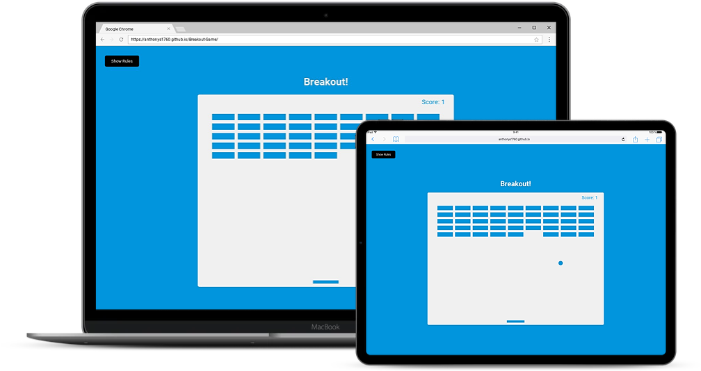

## Breakout! Game

Game where you control a paddle with the arrow keys to bounce a ball up to break bricks. This app uses the HTML5 canvas element and API

 

 ## Project Specifications

- Draw elements on canvas
- Use canvas paths to draw shapes
- Add animation with requestAnimationFrame(cb)
- Move paddle on arrow key press
- Add collision detection
- Keep score
- Add rules button with slider
 
## Steps to execute this game:
- Download the entire code 
- Open up the index.html.
- [View Live Site](https://anthonys1760.github.io/Breakout-Game/)

## Technologies used: 
- HTML
- CSS 
- Javascript

